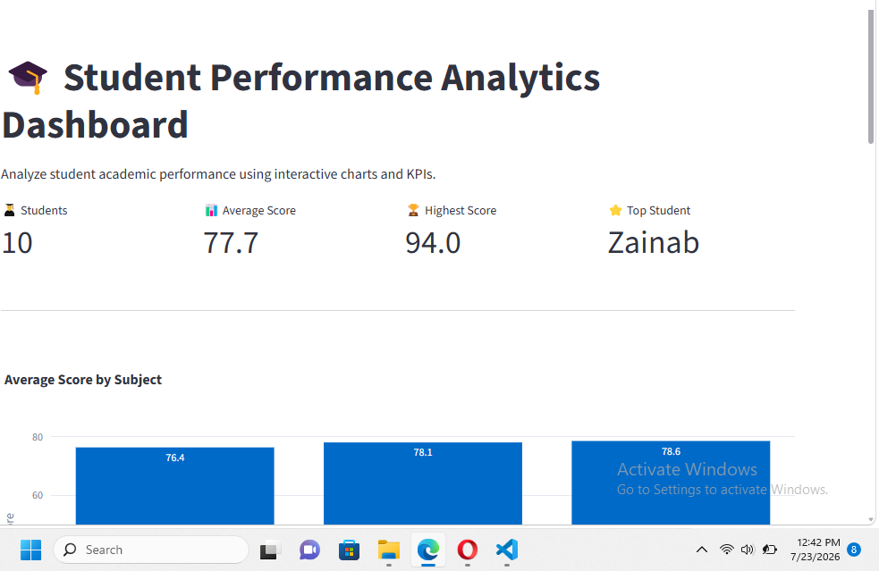

# 🎓 Student Performance Dashboard

An interactive dashboard built with **Python**, **Streamlit**, **Pandas**, and **Plotly** for analyzing student academic performance.

## 📌 Project Overview

This dashboard helps users analyze student performance by displaying key performance indicators (KPIs), interactive visualizations, and detailed student records.

The application demonstrates practical data analytics and dashboard development using Python.

---

## ✨ Features

- 📊 Interactive dashboard
- 📈 KPI cards
- 📚 Read data from Excel
- 📋 Interactive student records table
- 🎨 Responsive Streamlit interface
- 📉 Average score calculation
- 🔍 Data filtering (coming soon)

---

## 🛠️ Technologies Used

- Python
- Streamlit
- Pandas
- Plotly
- OpenPyXL

---

## 📂 Project Structure

```text
Student_Performance_Dashboard/
│
├── app.py
├── README.md
├── requirements.txt
├── .gitignore
│
├── data/
│   └── students.xlsx
│
└── venvz/
```

---

## 🚀 Installation

Clone the repository:

```bash
git clone https://github.com/Abdulganiyuz/Student_Performance_Dashboard.git
```

Go into the project folder:

```bash
cd Student_Performance_Dashboard
```

Install the required packages:

```bash
pip install -r requirements.txt
```

Run the application:

```bash
streamlit run app.py
```

---

## 📊 Dashboard Preview



---

## 🎯 Future Improvements

- Sidebar filters
- Student ranking
- Interactive charts
- Download filtered data
- Deployment on Streamlit Community Cloud

---

## 👨‍💻 Author

**Abdulganiyu Zubairu**

AI Engineering Student | Python | Data Analytics | Streamlit | Git & GitHub

GitHub:
https://github.com/Abdulganiyuz
---

## 📊 Dashboard Preview

